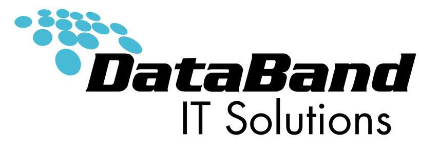
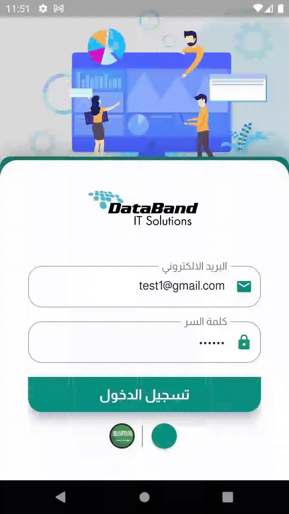

> 📱 **Data-Band**  
> A real-time speech-to-text app built with Flutter, designed to support individuals who are deaf or hard of hearing.

---
# 📱 Data-Band

**Data-Band** is a Flutter-based mobile application designed to streamline technical support and asset issue reporting between client companies and a central service provider. The app allows users to quickly report device or equipment problems using images and descriptions, enabling efficient and organized support ticket management.

---

## 🚀 Features

- 📸 Submit issue reports with photos and descriptions  
- 📨 Real-time ticket submission to the service provider  
- 📊 Admin panel for tracking and resolving reports  
- 🔔 Notifications for ticket status updates  
- 🧑‍🤝‍🧑 Role-based access for clients and admins

---

## 🎯 Use Case

Ideal for companies that distribute devices to partners or clients and want a seamless way to receive and manage technical issues.

---

## 🛠️ Technologies Used

- **Flutter** — for cross-platform mobile development  
- **Firebase** — for authentication, cloud storage, and real-time database  
- **Google Cloud** — for secure image hosting  
- **REST APIs** — for backend integration

---

## 🎬 Demo
p align="center">
  

---
## 🧑‍💻 Author

**Mohamed Mohamed Barakat**  

